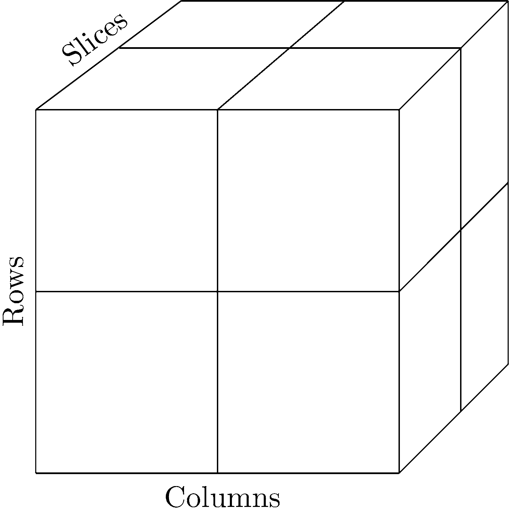

```{r include=FALSE}
knitr::opts_chunk$set(fig.path = 'figurasR/',
                      echo = FALSE, warning = FALSE, message = FALSE,
                      fig.pos="H",fig.align="center",out.width="95%",
                      cache=FALSE)

```

<!-- \setcounter{chapter}{2} -->

<!-- \setcounter{chapter}{2} escribir 2 para capítulo 3  -->

<!-- \pagenumbering{arabic} -->

```{=tex}
\ifdefined\ifprincipal
\else
\setlength{\parindent}{1em}
\pagestyle{fancy}
\setcounter{tocdepth}{4}
\tableofcontents
```
<!-- \nocite{*} -->

\fi

```{=tex}
\ifdefined\ifdoblecara
\fancyhead{}{}
\fancyhead[LE,RO]{\scriptsize\rightmark}
\fancyfoot[LO,RE]{\scriptsize\slshape \leftmark}
\fancyfoot[C]{}
\fancyfoot[LE,RO]{\footnotesize\thepage}
\else
\fancyhead{}{}
\fancyhead[RO]{\scriptsize\rightmark}
\fancyfoot[LO]{\scriptsize\slshape \leftmark}
\fancyfoot[C]{}
\fancyfoot[RO]{\footnotesize\thepage}
\fi
\renewcommand{\headrulewidth}{0.4pt}
\renewcommand{\footrulewidth}{0.4pt}
```
# Medidas para Variables Nominales

Este capítulo se centra en las medidas de asociación diseñadas para las variables de nivel nominal, pero indagando en los métodos estadísticos de permutación exactos y de Monte Carlo para las medidas de asociación nominal que se basan en criterios distintos del estadístico de prueba chi-cuadrado de Pearson.

En primer lugar, se describen dos medidas asimétricas de asociación de nivel nominal propuestas por Goodman y Kruskal en 1954, $\lambda$ y $t$. A continuación, el coeficiente kappa no ponderado de Cohen, $\kappa$, que proporciona una introducción a la medición de la concordancia, en contraste con las medidas de asociación. También se incluyen en el capítulo las pruebas $Q$ de McNemar y Cochran, que miden el grado en que las medidas de respuesta cambian con el tiempo, la medida $d^c_N$ de Leik y Gove de asociación nominal, y una solución al problema de ocupación de la matriz propuesta por Mielke y Siddiqui.

La prueba de probabilidad exacta de Fisher es la prueba de permutación ideal para las tablas de contingencia. Mientras que la prueba exacta de Fisher suele limitarse a las tablas de contingencia de $2\times2$, para las que se concibió originalmente, en este capítulo la prueba exacta de Fisher se extiende a las tablas de contingencia de $2\times c$, $3\times3$, $2\times2\times2$ y otras más grandes.

Algunas medidas diseñadas para variables de nivel ordinal también sirven como medidas de asociación para variables de nivel nominal cuando $r$ (número de filas) $= 2$ y $c$ (número de columnas) $= 2$, es decir, una tabla de contingencia $2\times2$. Otras medidas se diseñaron originalmente para tablas de contingencia $2\times2$ con variables de nivel nominal, entre estas medidas de asociación están las diferencias porcentuales, las medidas $Q$ e $Y$ de Yule, los odds ratio y las medidas asimétricas de Somers, $d_{yx}$ y $d_{xy}$.

## Valores de probabilidad hipergeométrica

Los métodos estadísticos de permutación exacta, especialmente cuando se aplican a las tablas de contingencia, dependen en gran medida de los valores de probabilidad hipergeométricos. En esta sección, se hace una breve introducción a los valores de probabilidad hipergeométricos ilustrando su cálculo e interpretación. Para las tablas de contingencia de $2\times2$, el cálculo de los valores de probabilidad hipergeométricos es fácil de demostrar. Consideremos la siguiente tabla de contingencia $2\times2$:

|           | $A_1$    | $A_2$    | **Total** |
|-----------|----------|----------|-----------|
| $B_1$     | $n_{11}$ | $n_{12}$ | $R_1$     |
| $B_2$     | $n_{21}$ | $n_{22}$ | $R_2$     |
| **Total** | $C_1$    | $C_2$    | $N$       |

: Notación tablas de contingencia 2x2

donde $n_{11}$, . . . , $n_{22}$ denotan las cuatro frecuencias absolutas, $R_1$ y $R_2$ denotan los totales de las frecuencias marginales de cada fila, $C_1$ y $C_2$ denotan los totales de las frecuencias marginales de cada columna y $$
N=\sum_{i=1}^2\sum_{j=1}^2 n_{ij}
$$

Dado que la tabla de contingencia que aparece en la *Tabla 2.1* es una tabla $2\times2$ y, en consecuencia tiene sólo un grado de libertad, la probabilidad de cualquier frecuencia de celda constituye la probabilidad de toda la tabla de contingencia. Por lo tanto, el valor de la probabilidad del punto hipergeométrico para la celda que contiene $n_{11}$ viene dada por:

$$
p(n_{11}|R_1,C_1,N)=\left(\begin{array}{c}C_1\\ n_{11}\end{array}\right)\left(\begin{array}{c}C_2\\ n_{12}\end{array}\right)\left(\begin{array}{c}N\\ R_1\end{array}\right)^{-1}=
$$

$$
=\left(\begin{array}{c}R_1\\ n_{11}\end{array}\right)\left(\begin{array}{c}R_2\\ n{21}\end{array}\right)\left(\begin{array}{c}N\\ C_1\end{array}\right)^{-1}=\frac{R_1!R_2!C_1!C_2!}{N!n_{11}!n_{12}!n_{21}!n_{22}!}
$$

El cálculo de los valores de probabilidad hipergeométricos para las tablas de contingencia $r\times c$ es más complejo que para las tablas de contingencia simples de $2\times2$. Consideremos la tabla de contingencia $4\times3$:

|           | $A_1$    | $A_2$    | $A_3$    | **Total** |
|-----------|----------|----------|----------|-----------|
| $B_1$     | $n_{11}$ | $n_{12}$ | $n_{13}$ | $R_1$     |
| $B_2$     | $n_{21}$ | $n_{22}$ | $n_{23}$ | $R_2$     |
| $B_3$     | $n_{31}$ | $n_{32}$ | $n_{33}$ | $R_3$     |
| $B_4$     | $n_{41}$ | $n_{42}$ | $n_{43}$ | $R_4$     |
| **Total** | $C_1$    | $C_2$    | $C_3$    | $N$       |

: Notación tablas de contingencia 4x3

donde $n_{11}$, . . . , $n_{43}$ denotan las $12$ frecuencias de las celdas frecuencias absolutas, $R_1 . . . , R_4$ denotan los totales de frecuencia marginal de las cuatro filas, $C_1$, $C_2$, y $C_3$ denotan los totales de las frecuencias marginales de las tres columna y$$
N=\sum_{i=1}^4\sum_{j=1}^3 n_{ij}   
$$

Cuando sólo hay dos filas, como en el ejemplo anterior de $2\times2$, cada valor de probabilidad de columna es binomial, pero con cuatro filas cada valor de probabilidad de columna es multinomial. Es bien sabido que un valor de probabilidad multinomial puede obtenerse de una serie interconectada de expresiones binomiales. Por ejemplo, para la columna $A_1$ de la *Tabla 2.2*:

$$
\left(\begin{array}{c}C_1\\ n_{11}\end{array}\right)\left(\begin{array}{c}C_1-n_{11}\\ n_{21}\end{array}\right)\left(\begin{array}{c}C_1-n_{11}-n_{21}\\ n_{31}\end{array}\right)=
$$

$$
=\frac{C_1!}{n_{11}!(C_1-n_{11})!}\times\frac{(C_1-n_{11})!}{n_{21}!(C_1-n_{11}-n_{21})!}\times\frac{(C_1-n_{11}-n_{21})!}{n_{31}(C_1-n_{11}-n_{21}-n_{31})!}=\frac{C_1!}{n_{11}!n_{21}!n_{31}!n_{42}!}
$$

Para la columna $A_2$:

$$
\left(\begin{array}{c}C_2\\ n_{12}\end{array}\right)\left(\begin{array}{c}C_2-n_{12}\\ n_{22}\end{array}\right)\left(\begin{array}{c}C_2-n_{12}-n_{22}\\ n_{32}\end{array}\right)=
$$

$$
=\frac{C_2!}{n_{12}!(C_2-n_{12})!}\times\frac{(C_2-n_{12})!}{n_{22}!(C_2-n_{12}-n_{22})!}\times\frac{(C_2-n_{12}-n_{22})!}{n_{32}(C_2-n_{12}-n_{22}-n_{32})!}=\frac{C_2!}{n_{12}!n_{22}!n_{32}!n_{42}!}
$$

y para la distribución de frecuencias marginales de las filas:

$$
\left(\begin{array}{c}N\\ R_1\end{array}\right)\left(\begin{array}{c}N-R_1\\ R_2\end{array}\right)\left(\begin{array}{c}N-R_1-R_2\\ R_3\end{array}\right)=
$$

$$
=\frac{N!}{R_1!(N-R_1)!}\times\frac{(N-R_1)!}{R_2!(N-R_1-R_2)!}\times\frac{(N-R_1-R_2)!}{R_3!(N-R_1-R_2-R_3)!}=\frac{N!}{R_1!R_2!R_3!R_4!}
$$

Por consiguiente, para tablas de contingencia $r$x$c$ se tiene:

$$
p(n_{ij}|R_i,C_j,N)=\frac{(\displaystyle\prod_{i=1}^rR_i!)(\prod_{j=1}^cC_j!)}{N!\displaystyle\prod_{i=1}^r\prod_{j=1}^cn_{ij}!}
$$

De esta forma, la ecuación anterior puede generalizarse fácilmente a tablas de contingencia multidireccionales más complejas [@Mielke1988].

Mientras que esta sección ilustra el cálculo de un valor de probabilidad puntual hipergeométrico, para una prueba de permutación exacta de una tabla de contingencia $r\times c$ es necesario calcular la medida de asociación seleccionada para las frecuencias de celdas observadas y, a continuación, enumerar exhaustivamente todos los posibles ordenamientos igualmente probables de los N objetos en las $rc$celdas, dadas las distribuciones de frecuencia marginal observadas.

Para cada ordenamiento en el conjunto de referencia de todas las permutaciones de las frecuencias de las celdas, se calcula una medida de asociación, $T$ , y el valor exacto de la probabilidad puntual hipergeométrica, $p(n_{ij} |R_i,C_j,N)$ para $i = 1$,... ,$r$ y $j = 1$, ... ,$c$. Sea $T_0$ el valor del estadístico de prueba observado, es decir, la medida de asociación, entonces, el valor de probabilidad exacto de $T_0$ es la suma de la probabilidad de los puntos hipergeométricos asociados a los valores de $T$ calculados en todos los posibles ordenamientos de las frecuencias de las celdas que son iguales o mayores que $T_0$.

Cuando el número de disposiciones posibles de las frecuencias es muy grande, las pruebas exactas son poco prácticas y se hacen necesarios los métodos estadísticos de permutación de Monte Carlo. Dadas las distribuciones de frecuencias marginales observadas, los métodos estadísticos de permutación de Monte Carlo generan una muestra aleatoria de todas las posibles ordenaciones de las frecuencias de las celdas, extraídas con reemplazo. El valor de la probabilidad a dos colas del remuestreo es simplemente la proporción de los valores $T$ calculados en los ordenamientos seleccionados aleatoriamente que son iguales o mayores que $T_0$. En el caso del remuestreo de Monte Carlo los valores de probabilidad hipergeométricos no están implicados, simplemente se necesita la proporción de los valores de las medidas de asociación (valores $T$) iguales o mayores que el valor de la medida de asociación observada ($T_0$).

## Medidas $\lambda_a$ y $\lambda_b$ de Goodman y Kruskal

Un problema común al que se enfrentan muchos investigadores es el análisis de una tabla de clasificación cruzada en la que ambas variables son categóricas, ya que las variables categóricas no suelen contener tanta información como las variables de nivel ordinal o de intervalo. Las medidas basadas en la chi-cuadrado, como la $\phi^2$ de Pearson, la $T^2$ de Tschuprov, la $V^2$ de Cramér y la $C$ de Pearson, han demostrado ser menos que satisfactorias debido a las dificultades de interpretación.

En 1954, Leo Goodman y William Kruskal propusieron varias medidas nuevas de asociación [@Goodman1954]. Entre las medidas se encontraban dos medidas de predicción asimétricas de reducción proporcional en el error para los análisis de una muestra aleatoria de dos variables categóricas: $\lambda_a$, para cuando se considera que $A$ es la variable dependiente, y $\lambda_b$, para cuando se considera que $B$ es la variable dependiente.

Sea una tabla de contingencia $r\times c$ como la representada a continuación:

| B\\A      | $A_1$    | $A_2$    | ... | $A_c$    | Total    |
|-----------|----------|----------|-----|----------|----------|
| $B_1$     | $n_{11}$ | $n_{12}$ | ... | $n_{1c}$ | $n_{1.}$ |
| $B_2$     | $n_{21}$ | $n_{22}$ | ... | $n_{2c}$ | $n_{2.}$ |
| ...       | ...      | ...      | ... | ...      | ...      |
| $B_r$     | $n_{r1}$ | $n_{r2}$ | ... | $n_{rc}$ | $n_{r.}$ |
| **Total** | $n_{.1}$ | $n_{.2}$ | ... | $n_{.c}$ | $N$      |

: Notación para la clasificación cruzada de dos variables categóricas, A_j con j=1,...,c y B_i con i=1,...,r

donde $A_j$ con $j = 1,...,c$ representan las $c$ categorías de la variable dependiente $A$, $B_i$ con $i = 1, . . . , r$ denotan las $r$ categorías para la variable independiente $B$, $n_{ij}$ la frecuencia absoluta de celda para $i = 1, . . . r$ y $j = 1, . . . . c$, y $N$ es el total observaciones. Denotamos por un punto ($.$) la suma parcial de todas las filas o todas las columnas, según la posición del ($·$) en la lista de subíndices. Si el ($·$) está en la primera posición del subíndice la suma es sobre todas las filas y si el ($·$) está en la segunda posición de subíndice, la suma es sobre todas las columnas. Por lo tanto, $n_{i.}$ denota el total de la frecuencia marginal de la i-ésima fila, $i = 1, . . . r$, sumada en todas las columnas, y $n_{.j}$ indica la frecuencia marginal de la j-ésima columna, $j = 1, . . . . c$, sumada en todas las filas.

Teniendo en cuenta la notación de la *tabla 3*, se definen

$$
W=\sum_{i=1}^rmax(n_{i1},n_{i2},...,n_{ic})  ~~~~~~y~~~~~~ X=max(n_{.1},n_{.2},...,n_{.c})
$$

Entonces, $\lambda_a$ (siendo A la variable dependiente) viene dado por:

$$
\lambda_a=\frac{W-X}{N-X}
$$

De la misma manera, se definen

$$
Y=\sum_{j=1}^cmax(n_{1j},n_{2j},...,n_{rj})  ~~~~~~y ~~~~~~ Z=max(n_{1.},n_{2.},...,n_{r.})
$$

E igualmente, $\lambda_b$ (siendo B la variable dependiente) viene dado por:

$$
\lambda_b=\frac{Y-Z}{N-Z}
$$

Tanto $\lambda_a$ como $\lambda_b$ son medidas de reducción proporcional del error. Consideremos $\lambda_a$ y dos posibles casos:

-   Caso 1: Sólo son conocidas las categorías disjuntas de la variable dependiente $A$.

-   Caso 2: Son conocidas tanto las categorías disjuntas de la variable A como las categorías disjuntas de la variable independiente B.

En el caso 1, es conveniente que el investigador adivine la categoría de la variable dependiente $A$ que tiene la mayor frecuencia marginal total (moda), que en este caso es $X = max(n_{.1}, . . . , n_{.c})$. Entonces, la probabilidad de error es $N-X$; definimos esto como "errores del primer tipo" o $E_1$. En el caso 2, es conveniente que el investigador adivine la categoría de la variable dependiente A que tiene la mayor frecuencia absoluta (moda) en cada categoría de la variable independiente B, que en este caso es

$$
W=\sum_{i=1}^rmax(n_{i1},n_{i2},...,n_{ic})
$$

La probabilidad de error es entonces $N - W$; y lo definimos como "errores del segundo tipo" o $E_2$. Entonces, $\lambda_a$ puede expresarse como

$$
\lambda_a=\frac{E_1-E_2}{E_1}=\frac{N-X-(N-W)}{N-X}=\frac{W-X}{N-X}
$$

Como señalaron Goodman y Kruskal en 1954, se observó inmediatamente un problema con las interpretaciones tanto de $\lambda_a$ como de $\lambda_b$. Dado que ambas medidas estaban basadas en los valores modales de las categorías de la variable independiente, cuando los valores modales ocurrían todos en la misma categoría de la variable dependiente, $\lambda_a$ y $\lambda_b$ serían cero. Así, mientras que $\lambda_a$ y $\lambda_b$ sean iguales a cero bajo independencia, $\lambda_a$ y $\lambda_b$ también podían ser iguales a cero para casos distintos de independencia. Esto hace que tanto $\lambda_a$ como $\lambda_b$ sean difíciles de interpretar; en consecuencia, $\lambda_a$ y $\lambda_b$ rara vez se encuentran en estudios de la asociación de variables categóricas.

Así, como explicaron Goodman y Kruskal en 1954:

1.  $\lambda_a$ es indeterminada si y sólo si la población se encuentra en una columna; es decir, aparece en una categoría de la variable $A$.

2.  En caso contrario, el valor de $\lambda_a$ se encuentra entre 0 y 1.

3.  $\lambda_a$ es 0 si y sólo si el conocimiento de la clasificación $B$ no ayuda a predecir la clasificación $A$.

4.  $\lambda_a$ es 1 si y sólo si el conocimiento de un objeto de la categoría $B$ especifica completamente su categoría $A$, es decir, si cada fila de la tabla de clasificación cruzada contiene como máximo un valor distinto de cero.

5.  En el caso de la independencia estadística, $\lambda_a$, cuando está determinada, es cero. Lo contrario no tiene por qué ser cierto: $\lambda_a$ puede ser cero sin que haya independencia estadística.

6.  $\lambda_a$ no cambia con ninguna permutación de filas o columnas.

## Medidas $t_a$ y $t_b$ de Goodman y Kruskal

Como se ha señalado anteriormente, en 1954 Leo Goodman y William Kruskal propusieron varias medidas de asociación nuevas. Entre las medidas había una medida de predicción asimétrica de reducción proporcional del error, $t_a$, para el análisis de una muestra aleatoria de dos variables categóricas [@Goodman1]. Se consideran dos variables desordenadas cruzadas, $A$ y $B$, con la variable $A$ como variable dependiente y la variable $B$ como variable independiente. La *tabla 2.3* proporcionaba la notación para la clasificación cruzada.

El estadístico $t_a$ de Goodman y Kruskal es una medida de la reducción relativa del error de predicción en la que se definen dos tipos de errores. El primer tipo es el error de predicción basado únicamente en el conocimiento de la distribución de la variable dependiente, denominado "error del primer tipo" ($E_1$) y que consiste en el número esperado de errores al predecir las $c$ categorías de la variable dependiente$(a_1, . . . , a_c)$ a partir de la distribución observada de las marginales de la variable dependiente $(n_{.1}, . . . , n_{.c})$. El segundo tipo es el error de predicción basado en el conocimiento de las distribuciones de las de la variable independiente y de la dependiente, denominado "error del segundo tipo" ($E_2$) y que consiste en el número o los errores esperados al predecir las $c$ categorías de la variable dependiente $(a_1, . . . , a_c)$ a partir del conocimiento de las $r$ categorías de la variable independiente $(b_1, . . . , b_r)$.

Para ilustrar los dos tipos de error, se considera la predicción de la categoría $A_1$ a partir de sólo el conocimiento de su distribución marginal, $n_{.1}, . . . . n_{.c}$. Claramente, $n_{.1}$ de los $N$ casos totales están en la categoría $a_1$, pero se desconoce exactamente qué $n_{.1}$ de los $N$ casos. La probabilidad de identificar incorrectamente uno de los $N$ casos de la categoría $a_1$ viene dada por:

$$
\frac{N-n_{.1}}{N}
$$

Dado que se requieren $n_{.1}$ clasificaciones de este tipo, el número de clasificaciones incorrectas esperadas esperadas es

$$
\frac{n_.1(N-n_.1)}{N}
$$

y, para todas las $c$ categorías de la variable $A$, el número de errores esperados del primer tipo viene dado por:

$$
E_1=\sum_{j=1}^c\frac{n_.j(N-n_.j)}{N}
$$

Asimismo, para predecir $n_{11}, . . . , n_{1c}$ a partir de la categoría independiente $B_1$, la probabilidad de clasificar incorrectamente uno de los $n_{1.}$ casos de la celda $n_{11}$ es:

$$
\frac{n_{1.}-n_{11}}{n_{1.}}
$$

Dado que se requieren $n_{11}$ clasificaciones de este tipo, el número de clasificaciones incorrectas es

$$
\frac{n_{11}(n_{1.}-n_{11})}{n_{1.}}
$$

y, para todas las $cr$ celdas, el número de errores esperados del segundo tipo viene dado por:

$$
E_2=\sum_{j=1}^c\sum_{i=1}^r\frac{n_{ij}(n_{i.}-n_{ij})}{n_{i.}}
$$

El estadístico ta de Goodman y Kruskal se define, por tanto, como:

$$
t_a=\frac{E_1-E_2}{E_1}
$$

Una forma de cálculo eficiente para la $t_a$ de Goodman y Kruskal viene dada por:

$$
t_a=\frac{N\displaystyle\sum_{i=1}^r\displaystyle\sum_{j=1}^c\frac{n^2_{ij}}{n_{i.}}-\displaystyle\sum_{j=1}^cn^2_{.j}}{N^2-\displaystyle\sum_{j=1}^cn^2_{.j}}
$$

Un valor calculado de $t_a$ indica la reducción proporcional del error de predicción dado el conocimiento de la distribución de la variable independiente $B$ por encima del conocimiento de la distribución de la variable dependiente $A$. Como se define, $t_a$ es un estimador puntual del parámetro poblacional $\tau_a$ de Goodman y Kruskal para la población de la que se obtuvo la muestra de $N$ casos. Si la variable $B$ se considera la variable dependiente y la variable $A$ la variable independiente, entonces el estadístico de prueba de Goodman y Kruskal $t_b$ y el parámetro poblacional asociado $\tau_b$ se definen análogamente.

Como el parámetro $t_a$ toma valores de 0 a 1, posee una interpretación clara y significativa de reducción proporcional del error [@Costner1965], y se caracteriza por una alta validez intuitiva [@Hunter1973]; el estadístico de prueba $t_a$ plantea dificultades si la hipótesis nula es que $H_0: t_a = 0$ [@Margolin1974]. El problema es que la distribución muestral de $t_a$ no es asintóticamente normal bajo la hipótesis nula. En consecuencia, la aplicabilidad de $t_a$ de Goodman y Kruskal a las pruebas típicas de hipótesis nulas se ha visto muy limitada.

Aunque la $t_a$ fue desarrollada por Goodman y Kruskal en 1954, no fue hasta 1963 que se estableció la normalidad asintótica para $t_a$ y hasta 1972 no se obtuvo la varianza asintótica correcta para $t_a$, pero sólo para $0 < \tau_a < 1$ [@Goodman1963].

En 1971, Richard Light y Barry Margolin desarrollaron $R^2$, una técnica de análisis de la varianza para las variables de respuesta categóricas, llamada CATANOVA para CATegorical ANalysis Of VAriance [@Light1971.1]. Light y Margolin aparentemente no sabían que el $R^2$ era idéntico al $t_a$ de Goodman y Kruskal y que habían resuelto el viejo problema de probar $H_0: \tau_a = 0$. La igualdad entre $R^2$ y $t_a$ fue reconocida por primera vez por Särndal en 1974 [@Sarndal1974] y posteriormente discutida por Margolin y Light [@Margolin1974], donde demostraron que $t_a(N-1)(r-1)$ se distribuía según una chi-cuadrado con $(r - 1)(c - 1)$ grados de libertad bajo $H_0: \tau_a = 0$ cuando $N \rightarrow \infty$ [@Berry1985].

## Una prueba asimétrica de homogeneidad

A veces, se necesita determinar si las proporciones de elementos en un conjunto de categorías mutuamente excluyentes son las mismas para dos o más grupos. Cuando se extraen muestras aleatorias independientes de cada uno de los $g \ge 2$ grupos y luego se clasifican en $r \ge 2$ categorías mutuamente excluyentes, la prueba adecuada es una prueba de homogeneidad de las distribuciones $g$. En una prueba de homogeneidad, una de las distribuciones marginales se conoce antes de recoger los datos, es decir, los totales de frecuencia marginal de fila o columna que indican el número de elementos de cada uno de los $g$ grupos. Esto se denomina muestreo multinomial de *producto*, ya que la distribución de muestreo es el producto de $g$ distribuciones multinomiales y la hipótesis nula es que las $g$ distribuciones multinomiales son idénticas.

Una prueba de homogeneidad es bastante diferente de una prueba de independencia, en la que se extrae una única muestra y se clasifica en ambas variables. En una prueba de independencia, ambos conjuntos de totales de frecuencias marginales se conocen sólo después de que se hayan recogido los datos. Esto se denomina muestreo multinomial simple, ya que la distribución del muestreo es una distribución multinomial[@Bohning1989]. La prueba de homogeneidad más utilizada es la prueba chi-cuadrado de Pearson con $gl = (r - 1)(g - 1)$ grados de libertad. La prueba chi-cuadrado de homogeneidad de Pearson supone la hipótesis nula de que no hay diferencia en las proporciones de sujetos en un conjunto de categorías mutuamente excluyentes entre dos o más poblaciones [@Marascuilo1977].

La prueba de homogeneidad chi-cuadrado de Pearson es una prueba simétrica, que produce un solo valor para una tabla de contingencia $r\times g$. Por el contrario, una prueba asimétrica arroja dos valores dependiendo de la variable que se considere dependiente. Como señala Berkson, si las diferencias son todas en una dirección, una prueba simétrica como la chi-cuadrado es insensible a este hecho [@Berkson1938].

Una prueba simétrica de homogeneidad, por su naturaleza, excluye la información conocida sobre los datos: qué variable es la independiente y qué variable es la dependiente. Aunque a veces es necesario reducir el nivel de medición cuando no se pueden cumplir los requisitos de distribución, en general no es aconsejable utilizar una prueba estadística que descarte información importante.

Se consideran las variables $A$ y $B$, con $B$ la variable dependiente. Sean $B_1, . . . ,B_r$ las $r\ge 2$ categorías de la variable dependiente, $A_1, . . . , A_g$ las $g \ge 2$ categorías de la variable independiente, $n_{ij}$ la frecuencia de celda en la i-ésima fila y j-ésima columna, $i = 1, . , r$ y $j = 1, . . . , g$, y $N$ el tamaño total de la muestra. Sean $n_{1.}, . . . . n_{r.}$ las frecuencias marginales de la variable $B$ y $n_{.1}, … , n_{.g}$ las frecuencias marginales totales de la variable $A$. La clasificación cruzada de las variables A y B se muestra en la tabla siguiente:

| B\\A      | $A_1$    | $A_2$    | ... | $A_g$    | Total    |
|-----------|----------|----------|-----|----------|----------|
| $B_1$     | $n_{11}$ | $n_{12}$ | ... | $n_{1g}$ | $n_{1.}$ |
| $B_2$     | $n_{21}$ | $n_{22}$ | ... | $n_{2g}$ | $n_{2.}$ |
| ...       | ...      | ...      | ... | ...      | ...      |
| $B_r$     | $n_{r1}$ | $n_{r2}$ | ... | $n_{rg}$ | $n_{r.}$ |
| **Total** | $n_{.1}$ | $n_{.2}$ | ... | $n_{.g}$ | $N$      |

: Notación para la clasificación cruzada de dos variables categóricas, A_j para j=1,...,g y B_i para i=1,...,r

Aunque nunca se ha propuesto como prueba de homogeneidad, la prueba asimétrica $t_b$, introducida por primera vez por Goodman y Kruskal en 1954 [@Goodman1954], es una alternativa atractiva a la prueba simétrica de homogeneidad, la chi-cuadrado. El estadístico de la prueba viene dado por:

$$
t_b=\frac{N\displaystyle\sum_{j=1}^g\displaystyle\sum_{i=1}^r\frac{n^2_{ij}}{n_{.j}}-\displaystyle\sum_{i=1}^rn^2_{i.}}{N^2-\displaystyle\sum_{i=1}^rn^2_{i.}}
$$

donde $B$ es la variable dependiente y el parámetro poblacional asociado se denota como $\tau_b$. Si se considera que la variable dependiente es $A$, el estadístico de la prueba viene dado por dado por:

$$
t_a=\frac{N\displaystyle\sum_{i=1}^r\displaystyle\sum_{j=1}^g\frac{n^2_{ij}}{n_{i.}}-\displaystyle\sum_{j=1}^gn^2_{.j}}{N^2-\displaystyle\sum_{j=1}^gn^2_{.j}}
$$

y el parámetro poblacional asociado es $\tau_a$.

El estadístico de prueba $t_b$ toma valores entre $0$ y $1$; $t_b$ es $0$ si y sólo si hay homogeneidad sobre las $r$ categorías de la variable dependiente,$B$, para todos los $g$ grupos, y $t_b$ es 1 si y sólo si el conocimiento de la variable $A_j$, con $j = 1,. . . ,g$, determina completamente el conocimiento de la variable $B_i$ para $i = 1, . . . , r$. Del mismo modo, el estadístico de prueba $t_a$ es $0$ si y sólo si existe homogeneidad sobre las $g$ categorías de la variable dependiente,$A$, para todos los $r$ grupos, y $t_a$ es $1$ si y sólo si el conocimiento de la variable $B_i$, con $i = 1, . . . ,r$, determina completamente el conocimiento de la variable $A_j$ para $j = 1, . . . , g$.

Aunque no existe una equivalencia general para los estadísticos de prueba $t_b$ o $t_a$ con $\chi^2$, existen ciertas relaciones en condiciones especiales: Si $g = 2$, entonces $\chi^2 = Nt_b$, y si $g > 2$ y $n_{.j} = N/g$ para $j = 1, ... , g$, entonces $\chi^2= N(g -1)t_b$. Del mismo modo, si $r = 2$, $\chi^2 = Nt_a$, y si $r > 2$ y $n_{i.} = N/r$ para $i = 1, . . . , r$, entonces $\chi^2 = N(r - 1)t_a$. De lo anterior, se deduce que si $r = g = 2$, entoces \$t_b = t_a = $\chi^2/N$, que es el coeficiente de contingencia al cuadrado de la media de Pearson, $\phi^2$. Por último, cuando $N \rightarrow \infty$, se tiene que $t_b(N - 1)(r - 1)$ y $t_a(N - 1)(g - 1)$ se distribuyen según una chi-cuadrado con $(r - 1)(g - 1)$ grados de libertad.

Existen tres métodos para determinar el valor de la probabilidad del estadístico de prueba $t_b$ o $t_a$ calculado: procedimientos exactos, de remuestreo de Montecarlo y asintóticos. Explicaciones considerando sólo $t_b$, pero los métodos son análogos para $t_a$:

-   [Valores exactos de probabilidad:]{.ul} Bajo la hipótesis nula, $H_0: \tau_b = 0$, cada uno de los $M$ posibles ordenamientos de los $N$ elementos sobre las categorías $rg$ de la tabla de contingencia es igualmente probable con distribuciones marginales fijas. Para cada ordenamiento de los datos observados en el conjunto de referencia de todos los ordenamientos posibles, se calcula el estadístico de prueba deseado. El valor de la probabilidad exacta de un estadístico de prueba $t_b$ observado es la suma de los valores de probabilidad puntuales hipergeométricos asociados a valores mayores o iguales a $t_b$.

-   [Valores de probabilidad de remuestreo:]{.ul} Una prueba exacta no es práctica desde el punto de vista computacional, excepto para muestras bastante pequeñas. Un método alternativo que evita las exigencias computacionales de una prueba exacta es una aproximación de permutación por remuestreo. Bajo la hipótesis nula, $H_0: \tau_b = 0$, las pruebas de permutación por remuestreo generan y estudian un subconjunto aleatorio de Monte Carlo de todos los posibles ordenamientos igualmente probables de los datos observados. Para cada ordenamiento seleccionado al azar de los datos observados, se calcula el estadístico de prueba deseado. El valor de la probabilidad de remuestreo de Montecarlo de un estadístico de prueba $t_b$ observado es simplemente la proporción de los valores seleccionados aleatoriamente de $t_b$ iguales o mayores que el valor observado de $t_b$.

-   [Valores de probabilidad asintótica:]{.ul} Bajo la hipótesis nula, $H_0: \tau_b = 0$, como $N \rightarrow \infty$, $t_b(N-1)(g-1)$ se distribuye según una chi-cuadrado con $(r-1)(g-1)$ grados de libertad. El valor de la probabilidad asintótica es la proporción de la chi-cuadrado apropiada igual o mayor que el valor observado de $t_b(N -1)(g-1)$.

## Medidas de concordancia

La medición de la concordancia es un caso especial de medición de la asociación entre dos o más variables. Una serie de problemas de investigación estadística requieren medir la concordancia, en lugar de la asociación o la correlación. Los índices de concordancia miden el grado en que un conjunto de medidas de respuesta son idénticas a otro conjunto, es decir, concuerdan.

Su uso surge se asignan objetos a un conjunto de categorías desordenadas y disjuntas. En 1957, Robinson explicó que la concordancia estadística requiere que los valores emparejados sean idénticos, mientras que la correlación sólo requiere que los valores emparejados estén empatados por alguna función matemática [@Robinson1957]. Por tanto, la concordancia es una medida más restrictiva que la correlación. Robinson argumentó que la distinción entre acuerdo y correlación lleva a la conclusión de que una estimación lógicamente correcta de la fiabilidad de una prueba viene dada por el coeficiente de correlación intraclase en lugar del coeficiente de correlación de Pearson (interclase) y que el concepto de acuerdo, en lugar de correlación, es la base adecuada de la teoría de la fiabilidad.

Según Berry, una medida de acuerdo entre evaluadores debería, como mínimo, incorporar siete atributos básicos [@Berry1988]:

-   Una medida de concordancia debe ser corregida por el azar, es decir, cualquier coeficiente de concordancia debe reflejar la cantidad de concordancia que excede lo que se esperaría por el azar. Varios investigadores han defendido las medidas de concordancia corregidas por el azar, como Brennan y Prediger [@Brennan1981] o Cicchetti, Showalter y Tyrer [@Cicchetti1985]. Aunque algunos otros han argumentado en contra, por ejemplo, Armitage, Blendis y Smyllie [@Armitage1966]o Goodman y Kruskal [@Goodman1954], aunque los partidarios de las medidas de concordancia corregidas por el azar superan ampliamente a los detractores.

-   Una medida de concordancia entre evaluadores posee una ventaja añadida si es directamente aplicable a la evaluación de la fiabilidad. Robinson, en particular, hizo hincapié en que la fiabilidad no podía medirse simplemente mediante alguna función de la correlación producto-momento de Pearson, y argumentó que el concepto de concordancia debería ser la base de la teoría de la fiabilidad, no la correlación [@Robinson1957].

-   Varios investigadores han comentado la simplicidad de la distancia Euclídea para las medidas de concordancia entre evaluadores, señalando que la elevación al cuadrado de las diferencias entre los valores de las escalas es, en el mejor de los casos, cuestionable, aunque reconocen que las diferencias al cuadrado permiten interpretaciones más claras de los coeficientes [@Fleiss1973][@Krippendorff1970]. Además, Graham y Jackson señalaron que la elevación al cuadrado de las diferencias entre los valores, es decir, la ponderación cuadrática, da como resultado una medida de asociación, no de concordancia [@Graham1993]. Por lo tanto, la distancia Euclídea es una propiedad deseada para las medidas de concordancia entre evaluadores.

-   Toda medida de acuerdo debe tener una base estadística. Una medida de concordancia sin una prueba de significación adecuada está muy limitada en su aplicación a situaciones prácticas de investigación. Los análisis asintóticos son interesantes y útiles, en condiciones de muestras grandes, pero suelen tener una utilidad práctica limitada cuando el tamaño de las muestras es pequeño.

-   Una medida de concordancia que sirva para datos multivariantes tiene una ventaja decisiva sobre las medidas de acuerdo univariantes. Así, si un observador localiza un conjunto de datos en un espacio r-dimensional, una medida de concordancia multivariante puede determinar el grado en que un segundo observador localiza el mismo conjunto de datos en el espacio r-dimensional definido.

-   Una medida de concordancia debe ser capaz de analizar los datos en cualquier nivel de medición. La medida kappa de Cohen para la concordancia entre evaluadores es, actualmente, la medida de concordancia más utilizada. Se han establecido extensiones de la kappa de Cohen a datos clasificados de forma incompleta por Iachan [@Iachan1984] y a datos categóricos continuos por Conger [@Conger1985]. Una extensión de la medida de acuerdo kappa de Cohen a datos ordinales totalmente clasificados y a datos de intervalo fue proporcionada por Berry y Mielke en 1988 [@Berry1988].

-   Una medida de concordancia debe ser capaz de evaluar la información de más de dos calificadores o jueces. Fleiss propuso una medida de concordancia para múltiples calificadores en una escala nominal [@Fleiss1971]. Landis y Koch consideraron la concordancia entre varios calificadores en términos de una opinión mayoritaria [@Landis1977]. Light se centró en una extensión de la medida kappa de Cohen [@Cohen1960] de concordancia entre calificadores a múltiples calificadores que se basaba en la media de todos los valores kappa por pares [@Light1971.2]. Lamentablemente, la medida propuesta por Fleiss dependía de la proporción media de calificadores que estaban de acuerdo en la clasificación de cada observación y la formulación de Landis y Koch se vuelve computacionalmente prohibitiva si el número de observadores o el número de categorías de respuesta es grande. Además, la extensión de kappa propuesta por Fleiss no se redujo a una kappa de Cohen cuando el número de calificadores era de dos.

### Medida de concordancia de Robinson

Una de las primeras medidas de concordancia máxima corregida fue desarrollada por W.S. Robinson en 1957 [@Robinson1957]. Supongamos que hay $k = 2$ jueces y califican independientemente $N$ objetos. Robinson argumentó que la correlación producto-momento de Pearson (interclase) calculada entre las calificaciones de dos jueces era una medida inadecuada de concordancia porque mide el grado en que los valores emparejados de las dos variables son proporcionales, cuando se expresan como desviaciones de sus medias, en lugar de ser idénticos. Robinson propuso una nueva medida de concordancia basada en el coeficiente de correlación intraclase que denominó $A$. Sean dos conjuntos de valoraciones con $N$ pares de valores. Robinson definió $A$ como

$$
A=1-\frac{D}{D_{max}},
$$

donde $D$ (de Desacuerdo) viene dado por:

$$
D=\sum_{i=1}^N (X_{1i}-\bar X_i)^2 + \sum_{i=1}^N (X_{2i}-\bar X_i)^2
$$

y $X_{1i}=$ valor de $X_1$ para el i-ésimo par de valoraciones, $X_{2i}=$ valor de $X_2$ para el i-ésimo par de valoraciones, $\bar X_{i}=$ la media de $X_1$ y $X_2$ para el i-ésimo par de valoraciones.

Robinson observó que, por sí misma, $D$ no es una medida muy útil porque implica $X_1$ y $X_2$. Para encontrar una medida de concordancia relativa, más que absoluta, Robinson estandarizó $D$ por su rango de variación posible, dado por:

$$
D_{max}=\sum_{i=1}^N (X_{1i}-\bar X)^2 + \sum_{i=1}^N (X_{2i}-\bar X)^2,
$$

donde la media viene dada por:

$$
\bar X = \frac {\displaystyle\sum_{i=1}^N X_{1i}+\displaystyle\sum_{i=1}^N X_{2i}}{2N}
$$

**Coeficiente de correlación intraclase**

Es bien sabido que el coeficiente de correlación intraclase ($r_I$) entre $N$ pares de observaciones sobre dos variables es, por definición, el momento producto ordinario de Pearson (interclase) entre $2N$ pares de observaciones, de los cuales los primeros $N$ son las observaciones originales, y los segundos $N$ las observaciones originales con $X_{1i}$ sustituyendo a $X_{2i}$ y viceversa, con $i = 1, . . . N$ [@Fisher1934]:

$$
r_I=\frac{N\displaystyle\sum_{i=1}^N X_{1i}X_{2i}-\displaystyle\displaystyle\sum_{i=1}^N X_{1i}\sum_{i=1}^N X_{2i}}{\displaystyle\sqrt{[N\displaystyle\sum_{i=1}^N X^2_{1i}-(\displaystyle\sum_{i=1}^N X_{1i})^2][N\displaystyle\sum_{i=1}^N X^2_{2i}-(\displaystyle\sum_{i=1}^N X_{2i})^2]}}
$$

Para el caso de dos variables, las relaciones entre el coeficiente de concordancia de Robinson y el coeficiente de correlación intraclase vienen dadas por:

$$
r_I=2A-1; \\A=\frac{r_I+1}{2}
$$

Por tanto, en el caso de dos variables, la correlación intraclase es una función lineal simple del coeficiente de concordancia.

Para $k > 2$ conjuntos de valoraciones, las relaciones entre el coeficiente de correlación intraclase y la $A$ de Robinson no son tan simples y vienen dadas por:

$$
r_I=\frac{kA-1}{k-1}; \\ A=\frac{r_I(k-1)+1}{k}.
$$

De las expresiones anteriores se observa que el valor del coeficiente intraclase no depende sólo de $A$ sino también de $k$, el número variables. El rango de $A$ de Robinson siempre incluye los valores desde $0$ hasta $1$, independientemente del número de observaciones. Por lo tanto, las comparaciones entre los coeficientes de concordancia basados en diferentes números de variables son equiparables. El límite superior del coeficiente de correlación intraclase es siempre la unidad, pero su límite inferior es $-1/(k - 1)$. Para $k = 2$ variables, el límite inferior de $r_I$ es $-1$, pero para $k = 3$ variables es $-1/2$, para $k = 4$ es $-1/3$, para $k = 5$ el límite inferior es $-1/4$, y así sucesivamente.

### Medida de concordancia $\pi$ de Scott

Una de las primeras medidas de concordancia corregida por el azar fue introducida por William Scott en 1955 [@Scott1955]. Supongamos que dos jueces o calificadores clasifican independientemente cada una de las $N$ observaciones en una de las $c$ categorías. Las clasificaciones resultantes pueden mostrarse en una tabla de contingencia $c\times c$, con las frecuencias absolutas en cada celda. Sea $n_{i.}$ la frecuencia marginal de la i-ésima fila, $i = 1, . . . r$; sea $n_{.j}$ la frecuencia marginal de la j-ésima columna, $j = 1, . . . . c$ y sea

$$
N=\sum_{i=1}^r\sum_{j=1}^cn_{ij}
$$

frecuencia total de la tabla. El coeficiente de concordancia de Scott para los datos de nivel nominal viene dado por:

$$
\pi=\frac{p_o-p_e}{1-p_e}
$$

donde

$$
p_o=\frac{1}{N}\sum_{i=1}^c n_{ij} ~~~~~~~~ y ~~~~~~~~ p_e=\frac{1}{4N^2}\sum_{k=1}^c(n_{.k}+n_{k.})^2
$$

En esta configuración, $p_o$ es la proporción observada de observaciones en las que los jueces están de acuerdo, $p_e$ es la proporción de observaciones para las que se espera una concordancia por azar, $p_o - p_e$ es la proporción de concordancia más allá de la esperada por el azar, $1 - p_e$ es la máxima proporción posible de concordancia más allá de la esperada por el azar, y $\pi$ de Scott es la proporción de concordancia entre los dos jueces, una vez eliminada la concordancia por azar.

Aunque la $\pi$ de Scott es interesante desde una perspectiva histórica, esta medida ha caído en desuso. Basada en proporciones conjuntas, la $\pi$ de Scott asume que los dos jueces tienen la misma distribución de respuestas. La medida $\kappa$ de Cohen no hace esta suposición y, en consecuencia, ha surgido como la medida preferida de concordancia entre evaluadores corregida por el azar para dos jueces/calificadores.

### Medida de concordancia $\kappa$ de Cohen

Actualmente, la medida más popular de concordancia entre dos jueces o calificadores es la medida corregida por el azar, propuesta por primera vez por Jacob Cohen en 1960 y denominada kappa [@Cohen1960]. La kappa de Cohen mide la magnitud de la concordancia entre $b = 2$ observadores en la asignación de $N$ objetos a un conjunto de $c$ categorías disjuntas y desordenadas. En 1968, Cohen propuso una versión de kappa que permitía ponderar las $c$ categorías [@Cohen1968]. Mientras que el kappa original (no ponderado) no distinguía entre magnitudes de desacuerdo, el kappa ponderado incorporaba la magnitud de cada desacuerdo y proporcionaba un crédito parcial para las discordancias cuando la concordancia no era completa. El enfoque habitual consiste en asignar pesos a cada par de desacuerdos, con pesos mayores que indican un mayor desacuerdo.

Tanto en el caso no ponderado como en el ponderado, kappa es igual a $+1$ cuando se produce una concordancia perfecta entre dos o más jueces, $0$ cuando la concordancia es igual a la esperada en condiciones de independencia, y negativo cuando la concordancia es inferior a la esperada por azar. En esta sección se estudiará únicamente la kappa no ponderada, ya que es la que se usa normalmente para datos categóricos no ordenados.

Supongamos que dos jueces o calificadores clasifican independientemente cada una de las $N$ observaciones en una de las $c$ categorías desordenadas, exhaustivas y mutuamente excluyentes. Las clasificaciones resultantes pueden mostrarse en una clasificación cruzada $c\times c$ con proporciones para las entradas de las celdas:

| **Fila\\Columna** | **1**    | **2**    | **...** | **c**    | **Total** |
|-------------------|----------|----------|---------|----------|-----------|
| **1**             | $p_{11}$ | $p_{12}$ | ...     | $p_{1c}$ | $p_{1.}$  |
| **2**             | $p_{21}$ | $p_{22}$ | ...     | $p_{2c}$ | $p_{2.}$  |
| **...**           | ...      | ...      | ...     | ...      | ...       |
| **c**             | $p_{c1}$ | $p_{c2}$ | ...     | $p_{cc}$ | $p_{c.}$  |
| **Total**         | $p_{.1}$ | $p_{.2}$ | ...     | $p_{.c}$ | $p_{..}$  |

: Clasificación cruzada cxc con proporciones en celdas

Donde, $p_{i.}$ denota la proporción marginal de la i-ésima fila, $i = 1, . . . . c$; $p_{.j}$ denota la proporción marginal de la j-ésima columna, $j = 1, . . . . c$ y $p_{..} = 1,00$. Usando esta notación, el coeficiente kappa no ponderado de Cohen para datos de nivel nominal viene dado por:

$$
\kappa=\frac{p_o-p_e}{1-p_e},
$$

donde

$$
p_o=\sum_{i=1}^cp_{ii} ~~~~~~~ y ~~~~~~~ p_e=\sum_{i=1}^c
p_{i.}p_{.i}$$

El kappa de Cohen también puede definirse en términos de valores de frecuencia absoluta, lo que hace que los cálculos sean algo más sencillos. Así,

$$
\kappa=\frac{\displaystyle\sum_{i=1}^cO_{ii}-\displaystyle\sum_{i=1}^cE_{ii}}{N-\displaystyle\sum_{i=1}^cE_{ii}},
$$

donde $O_{ii}$ denota el valor de frecuencia de celda observado en la diagonal principal de la tabla de concordancia $c\times c$, $E_{ii}$ denota un valor de frecuencia de celda esperado en la diagonal principal, y

$$
E_{ii}=\frac{n_{i.}n_{.i}}{N}, ~~~~~i=1,..,c .
$$

En la configuración de la tabla anterior, $p_o$ es la proporción observada de observaciones en las que los jueces están de acuerdo, $p_e$ es la proporción de observaciones para las que se espera una concordancia es la proporción de concordancia esperada por el azar, $p_o -p_e$ es la proporción de concordancia más allá de la esperada por azar, $1 - p_e$ es la proporción máxima posible de concordancia más allá de lo esperado por el azar, y el estadístico de la prueba kappa de Cohen es la proporción de concordancia entre los dos jueces, una vez eliminada la concordancia por azar.

### Aplicación con Varios Jueces

La medida $\kappa$ de Cohen de la concordancia entre evaluadores corregida por el azar fue originalmente diseñada sólo para $b = 2$ jueces. En esta sección, se introduce un procedimiento para calcular $\kappa$ no ponderado con múltiples jueces. Aunque el procedimiento es apropiado para cualquier número de $c \ge 2$ categorías disjuntas y desordenadas y $b \ge 2$ jueces, la descripción del procedimiento se limita a $b = 3$ jueces independientes.

Sean $b = 3$ jueces que clasifican independientemente $N$ objetos en $c$ categorías disjuntas y desordenadas. La clasificación puede conceptualizarse como una tabla de contingencia $c\times c\times c$ con $c$ filas, $c$ columnas y $c$ ¿cortes?. Sean $n_{ijk}$ , $R_i$ , $C_j$ y $S_k$ las frecuencias esperadas de las celdas y las frecuencias marginales de las filas, las columnas y los ¿cortes? para $i, j, k = 1, . . . , c$. La frecuencia total viene dada por:

$$
N=\sum_{i=1}^c\sum_{j=1}^c\sum_{k=1}^cn_{ijk}~.
$$

El estadístico de la prueba kappa no ponderada de Cohen para una tabla de contingencia de tres vías está dado por:

$$
\kappa=1-\frac{\displaystyle\sum_{i=1}^c\sum_{j=1}^c\sum_{k=1}^cw_{ijk}n_{ijk}}{\displaystyle\sum_{i=1}^c\sum_{j=1}^c\sum_{k=1}^cw_{ijk}R_iC_jS_k}~~~~~~~~(2.1),
$$

donde $w_{ijk}$ son los "pesos" de desacuerdo asignados a cada celda para $i, j, k = 1, . , c$. Para el kappa no ponderado, los pesos de desacuerdo vienen dados por:

$$
w_{ijk}=\begin{cases}0 & i = j=k\\1 & c.c\end{cases}.
$$

Dada una tabla de contingencia $c\times c\times c$ con $N$ objetos clasificados de forma cruzada por $b = 3$ jueces independientes, una prueba de permutación exacta consiste en generar todos los ordenamientos posibles, igualmente probables, de los $N$ objetos en las $c^3$ celdas, preservando las distribuciones marginales de frecuencia. Para cada ordenamiento de las frecuencias de las celdas, se calcula el estadístico kappa no ponderado, $\kappa$, y el valor exacto de la probabilidad puntual hipergeométrica bajo la hipótesis nula, $p(n_{ijk} |R_i,C_j, S_k,N)$, donde

$$
p(n_{ijk} |R_i,C_j, S_k,N)=\frac{(\displaystyle\prod_{i=1}^cR_i!)(\prod_{j=1}^cC_j!)(\prod_{k=1}^cS_k!)}{(N!)^{b-1}\displaystyle\prod_{i=1}^c\prod_{j=1}^c\prod_{k=1}^cn_{ijk}!}~.
$$

Si $\kappa_o$ denota el valor del estadístico kappa no ponderado observado, el valor de probabilidad $\kappa_o$ exacto bajo la hipótesis nula viene dado por:

$$
P(\kappa_o)=\sum_{l=1}^M\Psi_l(n_{ijk} |R_i,C_j, S_k,N)~,
$$

donde

$$
\Psi_l(n_{ijk} |R_i,C_j, S_k,N)= \begin{cases}p(n_{ijk}|R_i,C_j,S_k) & si ~~ \kappa\ge\kappa_o\\0 & c.c\end{cases}
$$

y $M$ denota el número total de posibles ordenamientos de frecuencia de celdas igualmente probables en el conjunto de referencia de todos los ordenamientos posibles de las frecuencias de las celdas, dado las distribuciones de frecuencias marginales observadas. Cuando $M$ es muy grande, como es típico de contingencia multidireccional, las pruebas exactas no son prácticas y es necesario recurrir a los procedimientos de remuestreo de Monte Carlo. En estos casos, una muestra aleatoria de los $M$ posibles ordenamientos igualmente probables de las frecuencias de las celdas proporciona una comparación de los estadísticos de la prueba $\kappa$ calculados en $L$ tablas aleatorias multidireccionales con el estadístico de la prueba $\kappa$ calculado en la tabla de contingencia multidireccional observada.

Un algoritmo eficiente de remuestreo de Monte Carlo para generar ordenaciones aleatorias de frecuencias de celdas para tablas de contingencia multidireccionales con distribuciones de frecuencias marginales fijas fue desarrollado por Mielke, Berry y Johnston en 2007 [@Mielke2007]. Para una tabla de contingencia de tres dimensiones con $r$ filas, $c$ columnas y $s$ ¿cortes? el algoritmo de remuestreo se presenta en 12 sencillos pasos:

PASO 1. Construir una tabla de contingencia $r\times c\times s$ a partir de los datos observados.

PASO 2. Obtener los totales de frecuencia marginal fija $R_1, . . . , R_r , C_1, . . . , C_c, S_1, . . . S_s$ , y el total de frecuencias $N$. Establecer un contador de remuestreo $JL = 0$, y fijar $L$ igual al número de muestras deseado.

PASO 3. Establecer el contador de remuestreo $JL = JL + 1$.

PASO 4. Establecer los contadores de frecuencia marginal $JR_i = R_i$ para $i = 1, . , r$; $JC_j = C_j$ para $j = 1, . . . , c$; $JS_k = S_k$ para $k = 1, . . . . s$, y $M = N$.

PASO 5. Establecer $n_{ijk} = 0$ para $i = 1, . . . , r, j = 1, . . . . c$, y $k = 1, . . . , s$, y establecer los contadores de filas, columnas y ¿cortes? $IR$, $IC$ e $IS$ iguales a cero.

PASO 6. Crear las distribuciones de probabilidad acumulada $PR_i$ , $PC_j$ y $PS_k$ a partir de los totales de frecuencia marginal ajustados $JR_i$ , $JC_j$ y $JS_k$ para $i = 1, . , r, j = 1, . . . . c$, y $k = 1, . . . , s$, donde $PR_1 = JR_1/M$ y $PR_i = PR_{i-1} + JR_i/M$ para $i = 1, . . . , r$; $PC_1 = JC_1/M$ y $PC_j = PC_{j-1} + JC_j/M$ para $j = 1, . . . , c$ y $PS_1 = JS_1/M$ y $PS_k = PS_{k-1} + JS_k/M$ para $k = 1, . . . , s$.

PASO 7. Generar tres números pseudoaleatorios uniformes $U_r$ , $U_c$ y $U_s$ sobre $[0, 1)$ y establecer los índices de fila, columna y ¿corte? $i = j = k = 1$, respectivamente.

PASO 8. Si $U_r \le PR_i$, entonces $IR = i$, $JR_i = JR_i - 1$, e ir al PASO 9; en caso contrario $i = i + 1$ y se repite el PASO 8.

PASO 9. Si $U_c \le PC_j$ , entonces $IC = j$ , $JC_j = JC_j-1$, e ir al PASO 10; en caso contrario, $j = j + 1$ y se repite el PASO 9.

PASO 10. Si $U_s \le PS_k$, entonces $IS = k$, $JS_k = JS_k -1$, e ir al PASO 11; en caso contrario, $k = k + 1$ y se repite el PASO 10.

PASO 11. Establecer $M = M - 1$ y $n_{IR,IC,IS} = n_{IR,IC,IS} + 1$. Si $M >0$, ir al PASO 4; en caso contrario, obtener el estadístico de prueba requerido.

PASO 12. Si $JL < L$, ir al PASO 3; en caso contrario, STOP.

Al terminar el procedimiento de remuestreo, se obtiene la $\kappa$ de Cohen, como se indica en la ecuación (2.1), para cada una de las $L$ tablas de contingencia aleatorias de tres dimensiones, dadas las distribuciones de frecuencia marginal fijas. Si $\kappa_o$ denota el valor observado de $\kappa$, entonces bajo la hipótesis nula, el valor de la probabilidad aproximada del remuestreo para $\kappa_o$ viene dado por:

$$
P(\kappa_o)=\frac{1}{L}\sum_{l=1}^L\Psi_l(\kappa),
$$

donde

$$
\Psi_l(\kappa)=\begin{cases}1 & si ~~ \kappa\ge\kappa_o\\0 & c.c\end{cases}~.
$$

## Test Q de McNemar para el cambio

En 1947, el psicólogo Quinn McNemar propuso una prueba de cambio derivada de la prueba $t$ de pares emparejados para proporciones [@McNemar1947]. Una aplicación típica es analizar respuestas binarias, codificadas con 0s y 1s, en $g = 2$ periodos de tiempo para cada uno de los $N \ge 2$ sujetos, como Éxito y Fracaso, Sí y No, De acuerdo y Desacuerdo, o A favor y en contra. Si las cuatro celdas se identifican como en la siguiente tabla:

| **Tiempo 1\\Tiempo 2** | **Favor** | **Contra** | **Total** |
|------------------------|-----------|------------|-----------|
| **Favor**              | $A$       | $B$        | $A+B$     |
| **Contra**             | $C$       | $D$        | $C+D$     |
| **Total**              | $A+C$     | $B+D$      | $N$       |

: Notación de una tabla de clasificación cruzada 2x2 para el test Q de McNemar

entonces la prueba de McNemar para el cambio viene dada por:

$$
Q=\frac{(B-C)^2}{B+C}~,
$$

donde $N = A + B + C + D$ y $B$ y $C$ representan las dos celdas de cambio, es decir, de Favor a Contra y de Contra a Favor.

Alternativamente, la prueba Q de McNemar puede considerarse como un test de bondad de ajuste de una chi-cuadrado con dos categorías, donde las frecuencias observadas, $O_1$ y $O_2$, corresponden a las celdas $B$ y $C$, respectivamente, y las frecuencias esperadas, $E_1$ y $E_2$, vienen dadas por $E_1 = E_2 = \frac{B + C}{2}$, es decir se espera que la mitad de los sujetos cambien en una dirección (por ejemplo, de Favor a Contra) y la otra mitad en la otra dirección (por ejemplo, de Contra a Favor), bajo la hipótesis nula de que no hay cambios del Tiempo 1 al Tiempo 2.

Sea

$$
E=\frac{B+C}{2}
$$

el valor esperado en el que, por azar, la mitad de los cambios son de Favor a Contra y la otra mitad son de Contra a Favor. Entonces, la bondad de ajuste de una chi-cuadrado para las dos categorías de cambio viene dada por:

$$
\chi^2=\frac{(B-E)^2}{E}+\frac{(C-E)^2}{E}=\frac{B^2}{E}+\frac{C^2}{E}+2E-2B-2C~.
$$

Sustituyendo $E$ por $(B + C)/2$ se obtiene:

$$
\chi^2=\frac{2B^2}{B+C}+\frac{2C^2}{B+C}+B+C-2B-2C=\frac{2B^2}{B+C}+\frac{2C^2}{B+C}-B-C=
$$

$$
=\frac{2B^2+2C^2-B(B+C)-C(B+C)}{B+C}=\frac{B^2-2BC+C^2}{B+C} \Rightarrow
$$

$$
\Rightarrow \chi^2=\frac{(B-C)^2}{B+C}
$$

## Test Q de Cochran para el cambio

La variable dicotómica desempeña un gran papel y tiene muchas aplicaciones en la investigación y la medición. Convencionalmente, se asigna un valor de uno a cada elemento de la prueba que un sujeto responde correctamente y un cero a cada respuesta incorrecta.

En 1950, William Cochran publicó un artículo sobre "La comparación de porcentajes en muestras emparejadas" [@Cochran1950]. En este breve pero formativo artículo, Cochran describió una prueba de igualdad de proporciones emparejadas que ahora se utiliza ampliamente en la investigación educativa y psicológica. El emparejamiento puede basarse en las características de diferentes sujetos o en los mismos sujetos bajo diferentes condiciones.

El test $Q$ de Cochran puede considerarse una extensión del test de McNemar a tres o más condiciones de tratamiento. Supongamos que se observa una muestra de $N \ge 2$ sujetos en una situación en la que en cada sujeto actúa individualmente bajo cada una de las $k \ge 1$ condiciones experimentales diferentes. La actuación se puntúa como un éxito (1) o como un fracaso (0). La pregunta de investigación evalúa si la proporción real de éxitos es constante a lo largo de los $k$ períodos de tiempo.

El estadístico del test $Q$ de Cochran para el análisis de $k$ condiciones de tratamiento (columnas) y $N$ sujetos (filas) viene dado por:

$$
Q=\frac{(k-1)(k\displaystyle\sum_{j=1}^kC_j^2-A^2)}{kA-B}
$$

donde

$$
C_j=\sum_{i=1}^Nx_{ij}
$$

es el número de 1s en la j-ésima de las $k$ columnas,

$$
R_i=\sum_{j=1}^kx_{ij}
$$

es el número de 1s en la i-ésima de las $N$ filas,

$$
A=\sum_{i=1}^NR_i~, ~~~~ B=\sum_{i=1}^NR_i^2~,
$$

y $x_{ij}$ indica la entrada de la celda de $0$ ó $1$ asociada a la i-ésima de las $N$ filas y la j-ésima de las $k$ columnas. La hipótesis nula estipula que cada una de los

$$
M=\prod_{i=1}^N\left(\begin{array}{c}k\\ R_i\end{array}\right)
$$

ordenamientos distinguibles de 1s y 0s dentro de cada una de las $N$ filas ocurren con igual probabilidad, dado que los valores de $R_1,…,R_N$ son fijos.

## Una medida sobre el Tamaño del Efecto para el test Q de Cochran

Las medidas del tamaño del efecto son cada vez más importantes a la hora de informar sobre los resultados de la investigación. Lamentablemente, no existen medidas del tamaño del efecto para muchas de las pruebas estadísticas más comunes. En esta sección, se presenta una medida del tamaño del efecto corregida por el azar para el test $Q$ de Cochran para proporciones relacionadas.

Consideremos un enfoque alternativo al test $Q$ de Cochran en el que se aplican $g$ tratamientos de forma independiente a cada uno de los $N$ individuos, con el resultado de cada aplicación del tratamiento registrado como $1$ o $0$, representando cualquier dicotomización adecuada de de los resultados del tratamiento, es decir, un diseño de bloques aleatorios en el que los individuos son los bloques y los resultados del tratamiento se registran como $1$ o $0$. Sean $x_{ij}$ las medidas de respuesta $1$ y $0$ registradas para $i = 1, . . . N$ y $j = 1, . . . , g$. Entonces, el estadístico del test de Cochran puede definirse como

$$
Q=\frac{g-1}{2\displaystyle\sum_{i=1}^Np_i(1-p_i)}[2(\sum_{i=1}^Np_i)(N-\sum_{i=1}^Np_i)-N(N-1)\delta]~,
$$

donde

$$
\delta=[g\left(\begin{array}{c}N\\ 2\end{array}\right)]^{-1}\sum_{k=1}^g\sum_{i=1}^{N-1}\sum_{j=i+1}^N|x_{ik}-x_{jk}|
$$

y

$$
p_i=\frac{1}{g}\sum_{j=1}^gx_{ij} ~~~~~~~para~~ i=1,...,N~,
$$

es decir, la proporción de valores $1$ para el i-ésimo individuo. Se observa que en esta representación la variación de $Q$ depende totalmente de $\delta$.

En 1979, Acock y Stavig [@Acock1979]propusieron un valor máximo para $Q$ dado por:

$$
Q_{max}=N(g-1)
$$

El valor máximo de $Q$ de Acock y Stavig fue empleado por Serlin, Carr y Marascuilo [@Serlin1982] para proporcionar una medida del tamaño del efecto de la $Q$ de Cochran dada por:

$$
\hat\eta_Q^2=\frac{Q}{Q_{max}}=\frac{Q}{N(g-1)}~,
$$

que estandarizó la $Q$ de Cochran por un valor máximo. Lamentablemente, el valor de $Q_{max} = N(g - 1)$ defendido por Acock y Stavig sólo se alcanza cuando cada sujeto $g$-tupla es idéntico y hay al menos un $1$ y un $0$ en cada $g$-tupla. Así $\hat\eta_Q^2$ es una medida de "máxima corrección" del tamaño del efecto y $0 \le \hat\eta_Q^2\le 1$ bajo estas singulares condiciones.

Supongamos que $0 < p_i < 1$ para $i = 1, . . . , N$ ya que $p_i = 0$ y $p_i = 1$ no son informativos. Si $p_i$ es constante para $i = 1, . . . . N$, entonces $Q_{max} = N(g-1)$. Sin embargo, para la gran mayoría de los casos en los que $p_i \ne p_j$ para $i\ne j$ , $Q_{max} < N(g -1)$. Por lo tanto, el uso rutinario de establecer $Q_{max} = N(g - 1)$ es problemático y conduce a resultados cuestionables.

También hay que señalar que $\hat\eta_Q^2$ es un miembro de la familia $V$ de medidas de asociación nominal basada en el estadístico de prueba $V^2$ de Cramér dado por:

$$
V^2=\frac{\chi^2}{\chi_{max}^2}=\frac{\chi^2}{N[min(r-1,c-1)]}~,
$$

donde $r$ y $c$ denotan el número de filas y columnas de una tabla de contingencia $r\times c$. Las dificultades para interpretar $V^2$ se extienden a las de $\hat\eta_Q^2$.

Wickens observó que la $V^2$ de Cramér carece de una interpretación intuitiva que no sea como un escalado de chi-cuadrado, lo que limita su utilidad [@Wickens1989]. Asimismo, Costner observó que $V^2$ y otras medidas basadas en la chi-cuadrado de Pearson carecen de interpretación para valores distintos de $0$ y $1$, o el máximo, dadas las distribuciones de frecuencia marginal observadas [@Costner1965]. Agresti y Finlay también señalaron que la $V^2$ de Cramér es muy difícil de interpretar y recomendaron otras medidas [@Agresti1997]. Blalock señaló que "todas las medidas basadas en el chi cuadrado son de alguna manera arbitrarias por naturaleza, y sus interpretaciones dejan mucho que desear... todas ellas dan mayor peso a las columnas o filas que tienen las marginales más pequeñas en lugar de que a las que tienen las marginales más grandes" [@Blalock1958]. Ferguson discutió el problema de utilizar frecuencias marginales idealizadas [@Ferguson1981], y Guilford señaló que medidas como la $\phi^2$ de Pearson, la $T^2$ de Tschuprov y la $V^2$ de Cramér necesariamente subestiman la magnitud de la asociación presente [@Guilford1950]. Dado que $\hat\eta_Q^2$ es simplemente un caso especial del $V^2$ de Cramér, presenta los mismos problemas de interpretación.

### Una medida del Tamaño del Efecto corregida por el azar

Las medidas de tamaño del efecto corregidas por el azar tienen mucho que ver con las medidas corregidas por el máximo. Una medida del tamaño del efecto corregida por el azar es una medida de concordancia entre los $N$ individuos sobre $g$ tratamientos, corregida por el azar. Varios investigadores han defendido las medidas del tamaño del efecto corregidas por el azar, como Brennan y Prediger [@Brennan1981], Cincchetti, Showalter y Tyrer [@Cicchetti1985], Conger [@Conger1985] o Krippendorff [@Krippendorff1970]. Una medida corregida por el azar es $0$ en condiciones de azar, $1$ cuando la concordancia entre los $N$ sujetos es perfecta, y negativa en condiciones de desacuerdo. Algunas medidas bien conocidas corregidas por el azar son el coeficiente de concordancia entre evaluadores de Scott, la medida de concordancia $u$ de Kendall y Babington Smith, los coeficientes no ponderados y ponderados de concordancia entre evaluadores de Cohen y la medida de la regla de pie de Spearman. Bajo ciertas condiciones, el coeficiente de correlación de orden de rango de Spearman es también una medida de concordancia corregida por el azar [@Spearman1904], es decir, cuando las variables $x$ e $y$ toman valores de $1$ a $N$ sin valores empatados, o cuando la variable $x$ incluye valores empatados y la variable $y$ es una permutación de la variable $x$, entonces el coeficiente de correlación de orden de rango de Spearman es tanto una medida de correlación como una medida de concordancia corregida por el azar.

Sean $x_{ij}$ las medidas de respuesta $(0, 1)$ para $i = 1, . . . N$ bloques y $j = 1, . . . , g$ tratamientos, entonces

$$
\delta=[g\left(\begin{array}{c}N\\ 2\end{array}\right)]^{-1}\sum_{k=1}^g\sum_{i=1}^{N-1}\sum_{j=i+1}^N|x_{ik}-x_{jk}|
$$

Bajo la hipótesis nula de que la distribución de $\delta$ asigna igual probabilidad a cada una de las $M=(g!)^N$posibles asignaciones de las $g$ medidas de respuesta dicotómicas a las $g$ posiciones de tratamiento para cada uno de los $N$ individuos, el valor medio de $\delta$ viene dado por

$$
\mu_\delta=\frac{2}{N(N-1)}[(\sum_{i=1}^Np_i)(N-\sum_{i=1}^Np_i)-\sum_{i=1}^Np_i(1-p_i)]~,
$$

donde

$$
p_i=\frac{1}{g}\sum_{i=1}^gx_{ij}~~~~~para~~i=1,...,N~.
$$

Entonces, una medida del tamaño del efecto corregida por el azar puede definirse como

$$
\mathfrak{R}=1-\frac{\delta}{\mu_\delta}~.
$$

### Ventajas de la medida $\mathfrak{R}$ del tamaño del efecto

Las medidas del tamaño del efecto corregidas por el azar, como $\mathfrak{R}$, poseen claras ventajas de interpretación sobre las medidas del tamaño del efecto corregidas por el máximo, como $\hat\eta_Q^2$. El problema con $\hat\eta_Q^2$ radica en la forma en que se maximiza $\hat\eta_Q^2$. El denominador de $\hat\eta_Q^2$, $Q_{max} = N(g-1)$, estandariza el valor observado de $Q$ para el tamaño de la muestra ($N$) y el número de tratamientos ($g$). Desafortunadamente, $N(g - 1)$ no estandariza $Q$ para los datos en los que se basa, sino que estandariza $Q$ en otro conjunto hipotético de datos no observados.

$\mathfrak{R}$ es la alternativa preferida a $\hat\eta_Q^2$ como medida del tamaño del efecto por dos razones:

-   Puede lograr un tamaño del efecto de $1$ para los datos observados, mientras que esto es a menudo imposible para $\hat\eta_Q^2$.

-   Es una medida del tamaño del efecto corregida por el azar, lo que significa que es $0$ en condiciones de azar, $1$ cuando la concordancia entre los $N$ sujetos es perfecta, y negativo en condiciones de desacuerdo.

Por lo tanto, posee una interpretación clara que se corresponde con el coeficiente de concordancia entre evaluadores de Cohen y otras medidas corregidas por el azar que son familiares para la mayoría de los investigadores. Por otro lado otro lado, $\hat\eta_Q^2$ no posee una interpretación significativa, excepto para los valores límite de $Q = 0$ y $Q = 1$.

## Medida de asociación $d^c_N$ de Leik y Gove

En 1971, Robert Leik y Walter Gove propusieron una nueva medida de asociación nominal basada en comparaciones por pares de las diferencias entre las observaciones [@Leik1971]. Insatisfechos con las medidas existentes de asociación nominal, Leik y Gove sugirieron una medida de asociación de reducción proporcional en el error que fuese corregida para la cantidad máxima real de asociación, dadas las distribuciones de frecuencias marginales observadas. La nueva medida se denominó $d_N^c$, donde $d$ indicaba el índice, siguiendo otros índices como $d_{yx}$ y $d_{xy}$ de Somers; el subíndice $N$ indicaba la relevancia de $d$ para una variable dependiente nominal; y el superíndice $c$ indicaba que la medida estaba corregida por las restricciones impuestas por las distribuciones de frecuencia marginal.

Al igual que $d_N^c$, muchas medidas de asociación para dos variables se han basado en comparaciones por pares de las diferencias entre las observaciones. Consideremos dos variables de nivel nominal que se han clasificado de forma cruzada en una tabla de contingencia $r\times c$, donde $r$ y $c$ denotan el número de filas y columnas, respectivamente. Sean $n_{i.}$, $n_{.j}$, y $n_{ij}$ la frecuencia marginal de la fila $i$, la frecuencia marginal de la columna $j$ y el número de objetos en la celda ${ij}$, respectivamente, para $i = 1, . , r$ y $j = 1, . . . . c$, y sea $N$ el número total de objetos en la tabla de contingencia $r\times c$. Si $y$ y $x$ representan las variables de fila y columna, respectivamente, hay $N(N - 1)/2$ pares de objetos en la tabla que pueden dividirse en cinco tipos de pares exhaustivos y mutuamente excluyentes:

-   pares concordantes

-   pares discordantes

-   pares empatados en la variable $y$ pero que difieren en la variable $x$

-   pares empatados en la variable $x$ pero que difieren en la variable $y$

-   pares empatados en ambas variables $x$ e $y$

Para una tabla de contingencia $r\times c$, los pares concordantes (pares de objetos que están clasificados en el mismo orden tanto en la variable $x$ como en la variable $y$) vienen dados por:

$$
C=\sum_{i=1}^{r-1}\sum_{j=1}^{c-1}n_{ij}(\sum_{k=i+1}^r\sum_{l=j+1}^cn_{kl})~,
$$

los pares discordantes (pares de objetos que se clasifican en un orden en la variable $x$ y en el orden inverso en la variable $y$) vienen dados por:

$$
D=\sum_{i=1}^{r-1}\sum_{j=1}^{c-1}n_{i,c-j+1}(\sum_{k=i+1}^r\sum_{l=1}^{c-j}n_{kl})~,
$$

los pares de objetos empatados en la variable $x$ pero que difieren en la variable $y$ vienen dados por:

$$
T_x=\sum_{i=1}^{r}\sum_{j=1}^{c-1}n_{ij}(\sum_{k=j+1}^cn_{ik})~,
$$

los pares de objetos empatados en la variable $y$ pero que difieren en la variable $x$ vienen dados por:

$$
T_y=\sum_{j=1}^{c}\sum_{i=1}^{r-1}n_{ij}(\sum_{k=i+1}^rn_{kj})~,
$$

y los pares de objetos empatados en la variable $x$ y en la variable $y$ vienen dados por:

$$
T_{xy}=\frac{1}{2}\sum_{i=1}^{r}\sum_{j=1}^{c}n_{ij}(n_{ij}-1)~.
$$

Entonces,

$$
C+D+T_x+T_y+T_{xy}=\frac{N(N-1)}{2}~.
$$

### Tabla de Contingencia Observada

A partir de la tabla de contingencia observada se obtienen los parámetros $C$, $D$, $T_x$, $T_y$ y $T_{xy}$.

### Tabla de Contingencia Esperada

Usando la tabla de contingencia observada, se contruye la tabla de contingencia esperada de la siguiente forma:

$$
E_{ij}=\frac{n_{i.}n_{.j}}{N} ~~~~~~ con ~~~ i=1,...,r ~~~ y ~~~j=1,..,c~.
$$

A partir de la tabla de contingencia esperada se obtienen los parámetros $C'$, $D'$, $T_x'$, $T_y'$ y $T_{xy}'$.

Afortunadamente, existe una forma más eficiente de calcular $C'$, $D'$, $T_x'$, $T_y'$ y $T_{xy}'$ sin calcular primero los valores esperados. En primer lugar, dadas las distribuciones de frecuencias marginales de filas y columnas observadas se calcula el número de pares de valores esperados de frecuencia de celdas esperadas empatados a las variables $x$ e $y$,

$$
T_{xy}'=\frac{1}{2N^2}(\sum_{i=1}^rn_{i.}^2)(\sum_{j=1}^cn_{.j}^2)-\frac{N}{2}
$$

A continuación, se calcula el número de pares de valores de frecuencia de celda esperados empatados a la variable $y$,

$$
T_y'=\frac{1}{2}\sum_{i=1}^rn_{i.}^2-\frac{N}{2}-T_{xy}'
$$

Del mismo modo, se calcula el número de pares de valores de frecuencia de celda esperados empatados a la variable $x$,

$$
T_x'=\frac{1}{2}\sum_{j=1}^cn_{.j}^2-\frac{N}{2}-T_{xy}'
$$

Por último, se calcula el número de pares concordantes y discordantes de valores de frecuencia de celdas esperados,

$$
C'=D'=\frac{1}{2}[\frac{N(N-1)}{2}-T_x'-T_y'-T_{xy}']
$$

Hay que tener en cuenta que $C'$, $D'$, $T_x'$, $T_y'$ y $T_{xy}'$ se calculan sobre los totales de frecuencia marginal de la tabla de contingencia observada, que son invariantes bajo permutaciones.

### Tabla de Contingencia Maximal

El estadístico de prueba $d_N^c$ se basa en tres tablas de contingencia: la tabla de valores observados, la tabla de valores esperados y una tabla de valores máximos que se describirá a continuación.

Un algoritmo para generar un ordenamiento de las frecuencias de las celdas en una tabla de contingencia $r\times c$ que proporciona el valor máximo de un conjunto estadístico es:

PASO 1: Mantener las frecuencias marginales observadas de una tabla de contingencia $r\times c$ y eliminar los valores de frecuencias de celdas ($n_{ij}$).

PASO 2: Si algún par de frecuencias marginales, uno de cada conjunto de marginales, son iguales entre sí, introducir ese valor en la tabla como $n_{ij}$ y restar el valor de los dos totales de frecuencia marginal. Repetir el PASO 2 hasta que no haya dos totales de frecuencia marginal iguales. Si todos los totales de frecuencia marginal se han reducido a cero, ir al PASO 5; de lo contrario, ir al PASO 3.

PASO 3: Observar la frecuencia marginal más grande que queda en cada conjunto e introducir el menor de los dos valores en $n_{ij}$ . A continuación, restar ese valor (más pequeño) de los dos totales de frecuencias marginales.

PASO 4: Si todos los totales de frecuencia marginal se han reducido a cero, ir al PASO 5; En caso contrario, ir al PASO 2.

PASO 5: Establecer los valores $n_{ij}$ restantes como $0$, $i = 1, . . . , r$ y $j = 1, . . . , c$.

Denotamos la doble comilla ('') como una suma de pares calculada sobre los valores de frecuencias de las celdas maximizadas. Entonces, el número de pares concordantes de valores de frecuencia de celda maximizada es

$$
C''=\sum_{i=1}^{r-1}\sum_{j=1}^{c-1}n_{ij}(\sum_{k=i+1}^r\sum_{l=j+1}^cn_{kl})~,
$$

el número de pares discordantes de valores de frecuencia celular maximizada es

$$
D''=\sum_{i=1}^{r-1}\sum_{j=1}^{c-1}n_{i,c-j+1}(\sum_{k=i+1}^r\sum_{l=1}^{c-j}n_{kl})~,
$$

el número de pares de valores de frecuencia de celda maximizados empatados a la variable $x$ es

$$
T_x''=\sum_{i=1}^{r}\sum_{j=1}^{c-1}n_{ij}(\sum_{k=j+1}^cn_{ik})~,
$$

el número de pares de valores de frecuencia celular maximizados empatados a la variable $y$ es

$$
T_y''=\sum_{j=1}^{c}\sum_{i=1}^{r-1}n_{ij}(\sum_{k=i+1}^rn_{kj})~,
$$

y el número de pares de valores de frecuencia celular maximizada empatados en ambas variables $x$ e $y$ es

$$
T_{xy}=\frac{1}{2}\sum_{i=1}^{r}\sum_{j=1}^{c}n_{ij}(n_{ij}-1)~.
$$

Entonces,

$$
C''+D''+T_x''+T_y''+T_{xy}''=\frac{N(N-1)}{2}~.
$$

### Cálculo de la $d_N^c$ de Leik y Gove

Dados los valores observados, esperados y maximizados de $C$, $D$, $T_x$ , $T_y$ y $T_{xy}$, los errores del primer tipo ($E_1$) -la variación entre la independencia y la máxima asociación- vienen dados por:

$$
E_1=T_y'-T_y''
$$

y los errores del segundo tipo ($E_2$) -la variación entre la tabla observada y la tabla de máxima asociación- vienen dados por:

$$
E_2=T_y-T_y''
$$

Entonces, a la manera de las medidas de asociación de reducción proporcional en el error,

$$
d_N^c=\frac{E_1-E_2}{E_1}=\frac{(T_y'-T_y'')-(T_y-T_y'')}{T_y'-T_y''}=\frac{T_y'-T_y}{T_y'-T_y''}
$$

Dado que $d_N^c$ es una medida simétrica, el número de valores empatados en la variable $x$ puede utilizarse en lugar del número de valores empatados en la variable $y$. Así pues,

$$
d_N^c=\frac{T_x'-T_x}{T_x'-T_x''}
$$

Alternativamente, $d_N^c$ puede definirse en términos del número de valores empatados tanto en $x$ como en $y$. Así,

$$
d_N^c=\frac{T_{xy}'-T_{xy}}{T_{xy}'-T_{xy}''}
$$

Como los datos son categóricos, $C$ y $D$ pueden considerarse agrupados. Por lo tanto,

$$
d_N^c=\frac{(C'+D')-(C+D)}{(C'-D')-(C''+D'')}
$$

Como señalan Leik y Gove, para ayudar a interpretar la relación entre las variables $x$ e $y$, sería preferible determinar explícitamente el número de pares perdidos por los requisitos marginales de la tabla de contingencia. La asociación puede entonces ser definida dentro de esos límites, permitiendo que el índice alcance la unidad si las frecuencias de las celdas están tan cerca de un patrón perfecto como lo permitan las distribuciones marginales. Así pues, la proporción de casos que se considera es

$$
1-\frac{2(T_x''+T_y'')}{N(N-1)}
$$

### Un test de permutación para $d_N^c$

Leik y Gove no proporcionaron un error estándar para el estadístico de prueba $d_ N^c$ [@Leik1969]. Por otro lado, las pruebas de permutación no suponen ni requieren el conocimiento de los errores estándar. Consideremos la expresión

$$
d_N^c=\frac{T_y'-T_y}{T_y'-T_y''}
$$

Es evidente que $T_y'$ y $T_y''$ son invariantes bajo permutación. Por lo tanto la probabilidad de $d_N^c$ bajo la hipótesis nula puede determinarse por la distribución discreta de permutación de $T_y$ sólo, que se obtiene fácilmente de la tabla de contingencia observada. Los métodos estadísticos de permutación exacta son muy eficaces cuando sólo se calcula la parte variable del estadístico de prueba definido en cada uno de los $M$ ordenamientos posibles de los datos observados; en este caso, $T_y$.

## Un problema de ocupación de la matriz

En muchas situaciones de investigación, es necesario examinar una secuencia de observaciones sobre un pequeño grupo de sujetos, donde cada observación se clasifica de una de dos maneras. Supongamos, por ejemplo, que se registra un Éxito ($1$) o un Fracaso ($0$) para cada uno de $N \ge 2$ sujetos en cada una de $k \ge 2$ tareas. La prueba estándar en estos casos es el [Test Q de Cochran para el cambio].

Sin embargo, cuando el número de sujetos es pequeño, por ejemplo, $2 \le N \le 6$, y el número de tratamientos es grande, por ejemplo, $20 \le k \le 400$, puede ser preferible una prueba alternativa al test $Q$ de Cochran. Estas condiciones de investigación surgen por varias razones. En primer lugar, se propone un estudio de grupo a largo plazo, pero pocos sujetos están dispuestos a comprometerse con la investigación debido al tiempo prolongado de la misma. En segundo lugar, un estudio longitudinal comienza con un número adecuado de sujetos, pero hay una alta tasa de abandono y no se puede justificar el análisis de supervivencia. En tercer lugar, muy pocos sujetos satisfacen el protocolo de investigación. Cuarto, el coste de cada observación/tratamiento es caro para el investigador. Quinto, los sujetos también generan mucho gasto. Sexto, se puede realizar un estudio piloto con un número reducido de sujetos para establecer la validez de la investigación antes de solicitar financiación para un estudio más amplio.

Consideremos una matriz de ocupación de $N\times k$ con $N$ sujetos (filas) y $k$ condiciones de tratamiento (columnas). Sea $x_{ij}$ la observación del i-ésimo sujeto ($i = 1, … , N$) en la j-ésima condición de tratamiento ($j = 1, … , k$), donde un éxito se codifica como $1$ y un fracaso como $0$. Para cualquier sujeto, un éxito puede ser resultado del tratamiento administrado o puede ser resultado de alguna otra causa o de una respuesta aleatoria, es decir, un falso positivo. Por lo tanto, una respuesta exitosa al tratamiento se cuenta sólo cuando todos los $N$ sujetos obtienen un éxito, es decir, una columna completa de valores $1$. Evidentemente, este enfoque no se generaliza bien a un gran número de sujetos, ya que no es realista que un gran número de sujetos responda de forma conjunta. El test $Q$ de Cochran es preferible cuando $N$ es grande.

En 1965, Mielke y Siddiqui presentaron un procedimiento exacto de permutación para el problema de ocupación de la matriz en el "Journal of the American Statistical Association" que es apropiado para muestras pequeñas ($N$) y un gran número de tratamientos ($k$) [@Mielke1965]. Sean

$$
R_i=\sum_{j=1}^kx_{ij}
$$

para $i = 1, . . . N$, los totales de los sujetos (filas), sea

$$
M=\prod_{i=1}^N\left(\begin{array}{c}k\\ R_i\end{array}\right)
$$

el número de matrices de ocupación $N \times k$ igualmente distinguibles en el conjunto de referencia, bajo la hipótesis nula, y sea $\nu = min(R_1, . . . , R_N)$. La hipótesis nula estipula que cada una de las $M$ configuraciones de $1$s y $0$s dentro de cada una de las $N$ filas ocurre con igual probabilidad, dado que los valores $R_1, . . . , R_N$ son fijos. Si $U_g$ es el número de configuraciones distintas en las que exactamente $k$ condiciones de tratamiento (columnas) se llenan de aciertos ($1$s), entonces

$$
U_\nu=\left(\begin{array}{c}k\\ \nu\end{array}\right)\prod_{i=1}^N\left(\begin{array}{c}k-\nu\\ R_i-\nu\end{array}\right)
$$

es el valor inicial de la relación recursiva

$$
U_g=\left(\begin{array}{c}k\\ g\end{array}\right)[\prod_{i=1}^N\left(\begin{array}{c}k-g\\ R_i-g\end{array}\right)-\sum_{j=g+1}^\nu\left(\begin{array}{c}k-g\\ j-g\end{array}\right)\frac{U_j}{\left(\begin{array}{c}k\\ j\end{array}\right)}] ~,
$$

donde $0 \le g \le \nu - 1$. Si $g = 0$, entonces

$$
M=\sum_{g=0}^\nu U_g
$$

y la probabilidad exacta de observar $s$ o más condiciones de tratamiento (columnas) completamente llenas de éxitos ($1$s) viene dada por:

$$
P=\frac{1}{M}\sum_{g=s}^\nu U_g~,
$$

donde $0\le s \le v$.

## Test exacto de Fisher

Aunque el test de probabilidad exacta de Fisher no es, estrictamente hablando, una medida de asociación entre dos variables de nivel nominal, ha adquirido tal importancia en el análisis de las tablas de contingencia $2\times2$, que excluir la prueba exacta de Fisher de su consideración sería una grave omisión. Dicho esto, sin embargo, la prueba de probabilidad exacta de Fisher proporciona la probabilidad de asociación más que una medida de la fuerza de la asociación. La prueba de probabilidad exacta de Fisher fue desarrollada de forma independiente por R.A. Fisher [@Fisher1935], Frank Yates [@Yates1934] y Joseph Irwin [@Irwin1935] a principios de la década de 1930. En consecuencia, la prueba se denomina a menudo test exacto de Fisher-Yates o test de probabilidad exacta de Fisher-Irwin.

Aunque la prueba de probabilidad exacta de Fisher se diseñó originalmente para tablas de contingencia $2\times2$ y se utiliza casi exclusivamente para este fin, en esta sección la prueba se amplía para aplicarla a otras tablas de contingencia más grandes. Para facilitar el cálculo y evitar expresiones factoriales grandes, un procedimiento de recursión con un valor inicial arbitrario proporciona un método eficaz para obtener los valores exactos de la probabilidad.

### Análisis exacto de Fisher con una tabla 2×2

Considere una tabla de contingencia $2\times2$ con $N$ casos, donde $x_o$ denota la frecuencia observada de cualquier celda y $r$ y $c$ representan las frecuencias marginales de fila y columna, respectivamente, correspondientes a $x_o$. La siguiente tabla ilustra la notación de una tabla de contingencia $2\times2$:

|           | $A_1$ | $A_2$     | Total |
|-----------|-------|-----------|-------|
| $B_1$     | $x$   | $r-x$     | $r$   |
| $B_2$     | $c-x$ | $N-r-c+x$ | $N-r$ |
| **Total** | $c$   | $N-c$     | $N$   |

: Notación de una tabla de contingencia 2x2

Si $H(x|r, c,N)$ es una función positiva definida recursivamente en la que

$$
H(x|r, c,N)=D\times\left(\begin{array}{c}r\\ x\end{array}\right)\left(\begin{array}{c}N-r\\ c-x\end{array}\right)\left(\begin{array}{c}N\\ c\end{array}\right)^{-1}=D\times\frac{r!c!(N-r)!(N-c)!}{N!x!(r-x)!(c-x)!(N-r-c+x)!}
$$

donde $D > 0$ es una constante desconocida, entonces resolviendo la relación recursiva

$$
H(x+1|r, c,N)=H(x|r, c,N)\times g(x)
$$

se obtiene

$$
g(x)=\frac{(r-x)(c-x)}{(x+1)(N-r-c+x+1)}~.
$$

El algoritmo puede emplearse entonces para enumerar todos los valores de $H(x|r, c,N)$, donde $a \le x \le b$, $a = max(0, r + c - N)$, $b = min(r, c)$, y $H(a|N, r, c)$ es inicialmente tomado como un valor positivo pequeño. El total sobre toda la distribución puede hallarse mediante:

$$
T=\sum_{k=a}^bH(x|r, c,N)~.
$$

Para calcular el valor de la probabilidad de $x_o$, dadas las distribuciones de frecuencias marginales observadas, se debe determinar la probabilidad puntual de la tabla observada. Este valor, designado por $U_2 = H(x|r, c,N)$, se encuentra recursivamente. A continuación, hay que identificar la cola de la distribución de probabilidad asociada a $U_2$. Sea

$$
U_1=\begin{cases}H(x_o-1|r,c,N) & si~~x_0 >a \\0 & si~~x_o = a\end{cases}
$$

y

$$
U_3=\begin{cases}H(x_o+1|r,c,N) & si~~x_0 <b \\0 & si~~x_o = b\end{cases}~.
$$

Si $U_1 > U_3$, $U_2$ se encuentra en la cola derecha de la distribución; en caso contrario, se define que $U_2$ está en la cola izquierda de la distribución, y los subtotales de una cola ($S_1$) y de dos colas ($S_2$) pueden hallarse mediante:

$$
S_1(x_o|r,c,N)=\sum_{k=a}^bK_kH(k|r,c,N)
$$

y

$$
S_2(x_o|r,c,N)=\sum_{k=a}^bL_kH(k|r,c,N)~,
$$

respectivamente, donde

$$
K_k=\begin{cases}1 & si~~U_1 \le U_3 ~~y~~k\le x_o~~ó~~si~~U_1>U_2~~y~~ k\ge x_o \\0 & c.c\end{cases}
$$

y

$$
L_k=\begin{cases}1 & si~~H(k|r,c,N)\le U_2 \\0 & c.c\end{cases}
$$

para $k = a, . . . , b$. Los valores de la probabilidad exacta de una y dos colas vienen dados entonces por:

$$
P_1=\frac{S_1}{T}~~~~~y~~~~~P_2=\frac{S_2}{T}~,
$$

respectivamente.

### Análisis exacto de Fisher con otras tablas de contigencia

Aunque el test exacto de Fisher se ha limitado en gran medida al análisis de tablas de contingencia $2\times2$, no es difícil extender el test exacto de Fisher a tablas de contingencia más grandes, aunque tales extensiones pueden generar un gran esfuerzo computacional. Consideremos un ejemplo de tabla de contingencia $2\times3$ con $N$ casos, donde $x_o$ denota la frecuencia observada de la celda en la primera fila y la primera columna, $y_o$ denota la frecuencia observada de la celda en la segunda fila y la primera columna, y $r_1$, $r_2$ y $c_1$ son las frecuencias marginales observadas en la primera fila, la segunda fila y la primera columna, respectivamente. Si $H(x, y)$, dados $N$, $r_1$,$r_2$ y $c_1$, es una función positiva definida recursivamente, la resolviendo de la relación recursiva

$$
H(x,y+1)=H(x,y)\times g_1(x,y)
$$

se obtiene

$$
g_1(x,y)=\frac{(c_1-x-y)(r_2-y)}{(1+y)(N-r_1-r_2-c_1+1+x+y)}~.~~~~~~~~~~~~~~~(2.2)
$$

Si $y = min(r_2, c_1 - x)$, entonces $H(x + 1, y) = H(x, y) \times g_2(x, y)$ donde

$$
g_2(x,y)=\frac{(c_1-x-y)(r_1-x)}{(1+x)(N-r_1-r_2-c_1+1+x+y)}~,~~~~~~~~~~~~~~~~~(2.3)
$$

dado que $max(0, r_1 + r_2 + c_1 - N - x) = 0$. Sin embargo, si $y = min(r_2, c_1 - x)$ y $max(0, r_1 + r_2 + c_1 - N - x) > 0$, entonces $H(x + 1, y - 1) = H(x, y) \times g_3(x, y)$, donde

$$
g_3(x,y)=\frac{y(r_1-x)}{(1+x)(r_2+1-y)}~.~~~~~~~~~~~~~~~~~~~~~~~~~(2.4)
$$

Las tres expresiones recursivas dadas en las ecuaciones (2.2), (2.3) y (2.4) pueden emplearse para enumerar completamente la distribución de $H(x, y)$, donde $a \le x \le b$, $a = max(0, r_1 + c_1 - N)$, $b = min(r_1, c_1)$, $c(x)\le y \le d(x)$, $c(x) = max(0, r_1 + r_2 + c_1 - N + x)$, $d(x) = min(r_2, c_1 - x)$ y $H[a, c(x)]$ se fija inicialmente en algún valor positivo pequeño. El total sobre la distribución completamente enumerada se puede calcular mediante:

$$
T=\sum_{x=a}^b\sum_{y=c(x)}^{d(x)}H(x,y)~.
$$

Para calcular el valor de la probabilidad de ($x_o$, $y_o$), dadas las distribuciones marginales de frecuencia observadas, debe ser obtenido el valor de la probabilidad puntual hipergeométrica de la tabla de contingencia observada $2\times3$; este valor también puede hallarse recursivamente. A continuación, hay que hallar la probabilidad de un resultado tan o más extremo. El subtotal viene dado por:

$$
S=\sum_{x=a}^b\sum_{y=c(x)}^{d(x)}J_{x,y}H(x,y)~,
$$

donde

$$
J_{x,y}=\begin{cases}1 & si~~H(x,y)\le H(x_o,y_o) \\0 & c.c\end{cases}
$$

para $x = a, . . . , b$ e $y = c(x), . . . , d(x)$. El valor exacto de probabilidad para la independencia asociada a las frecuencias de celdas observadas, $x_o$ e $y_o$, viene dado por $P = \frac{S}{T}$ .

### Análisis de tablas 2×2×2

La prueba de probabilidad exacta de Fisher no se limita a las tablas de contingencia de dos dimensiones. Considere una tabla de contingencia de $2\times2\times2$, como la representada en la siguiente figura:

```{r echo=FALSE,out.width='5cm',fig.align='center',fig.cap="\\label{fig:contingencia}Representación gráfica de una tabla de contingencia 2x2x2",fig.pos="H"}

```

donde $n_{ijk}$ denota la frecuencia de la celda de la i-ésima fila, j-ésima columna y k-ésimo ¿corte? para $i, j, k = 1, 2$. Sea $n_{i..}$ la frecuencia marginal de la i-ésima fila, $i = 1, . . . , r$; $n_{.j.}$ la frecuencia marginal de la j-ésima columna, $j = 1, . . . ,c$, y $n_{..k}$ la frecuencia marginal del ¿corte?-ésimo, $k = 1, . . . s$. Por lo tanto, $A = n_{1..}$, $B = n_{.1.}$, $C = n_{..1}$, y $N = n_{...}$ denotan los totales de frecuencia marginal observados de la primera fila, la primera columna, el primer ¿corte? y toda la tabla, respectivamente, de manera que $1 \le A \le B \le C \le N/2$. Además, sea $w = n_{111}$, $x = n_{112}$, $y = n_{121}$ y $z = n_{211}$ las frecuencias de las celdas de la tabla de contingencia $2\times2\times2$. Entonces, la probabilidad para cualquier $w$, $x$, $y$, y $z$ está dada por:

$$
P(w,x,y,z|A,B,C,N)=[A!(N-A)!B!(N-B)!C!(N-C)!]\times
$$

$$
\times[(N!)^2w!x!y!z!(A-w-x-y)!(B-w-x-z)!(C-w-y-z)!(N-A-B-C+2w+x+y+z)!]^{-1}
$$

[@Mielke1994]. Un algoritmo para calcular la probabilidad exacta de Fisher implica una estructura de bucle anidado y requiere dos etapas. En la primera se obtiene la probabilidad exacta, $U$, de la tabla de contingencia $2\times2\times2$ observada. En la segunda etapa se obtiene el valor de la probabilidad exacta de todas las tablas con valores de probabilidad puntual hipergeométrica iguales o inferiores a la probabilidad puntual de la tabla de contingencia observada. Los cuatro bucles anidados dentro de cada etapa son sobre los índices de frecuencia de las celdas $w$, $x$, $y$ y $z$, respectivamente. Los límites de $w$, $x$, $y$ y $z$ son

$$
0\le w\le M_w,~~0\le x\le M_x,~~0\le y\le M_y~~~ y~~~ L_x\le z\le M_z,
$$

respectivamente, donde $M_w = A$, $M_x = A-w$, $M_y = A-w-x$, $M_z = min(B -w- x,C - w - y)$, y $L_z = max(0,A + B + C - N - 2w - x - y)$.

El método de recursión puede ilustrarse con el cuarto bucle (interno) sobre $z$, dado $w$, $x$, $y$, $A$, $B$, $C$, y $N$ porque el bucle interno produce tanto $U$ en la primera etapa como el valor exacto de la probabilidad en la segunda etapa. Sea $H(w, x, y, z)$ una función recursiva positiva definida dados $A$, $B$, $C$ y $N$, que satisface

$$
H(w,x,y,z+1)=H(w,x,y,z)\times g(w,x,y,z)~,
$$

donde

$$
g(w,x,y,z)=\frac{(B-w-x-z)(C-w-z)}{(z+1)(N-A-B-C+2w+x+y+z+1)}~.
$$

Los tres bucles restantes de cada etapa inicializan $H(w, x, y, z)$. Sea $I_x = max(0,A + B + C - N)$ y se establece como valor inicial de $H(0, 0, 0, I_z)$ a una constante positiva arbitraria pequeña. Entonces, el total sobre la distribución completamente enumerada sería:

$$
T=\sum_{w=0}^{M_w}\sum_{x=0}^{M_x}\sum_{y=0}^{M_y}\sum_{z=L_x}^{M_x}H(w,x,y,z)~.
$$

Si $w_o$, $x_o$, $y_o$ y $z_o$ son los valores de $w$, $x$, $y$ y $z$ en la tabla de contingencia observada $2\times2\times2$, entonces $U$ y el valor exacto de la probabilidad ($P$) vienen dados por:

$$
U=H(w_o,x_o,y_o,z_o)/T
$$

y

$$
P=\sum_{w=0}^{M_w}\sum_{x=0}^{M_x}\sum_{y=0}^{M_y}\sum_{z=L_x}^{M_x}H(w,x,y,z)\psi(w,x,y,z)/T~,
$$

respectivamente, donde

$$
\psi(w,x,y,z)=\begin{cases}1 & si~~H(w,x,y,z)\le H(w_o,x_o,y_o,z_o) \\0 & si~~c.c.\end{cases} ~.
$$
